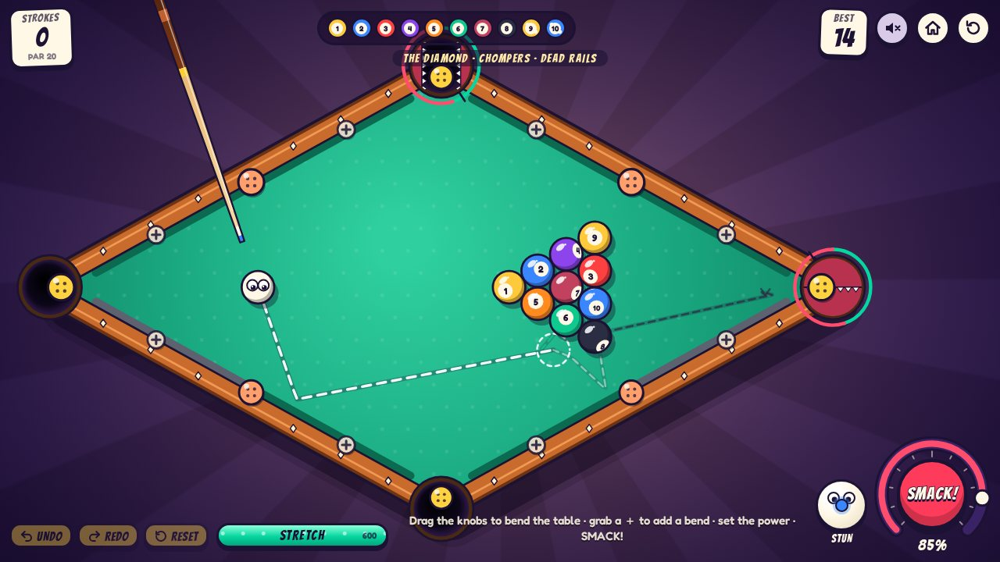
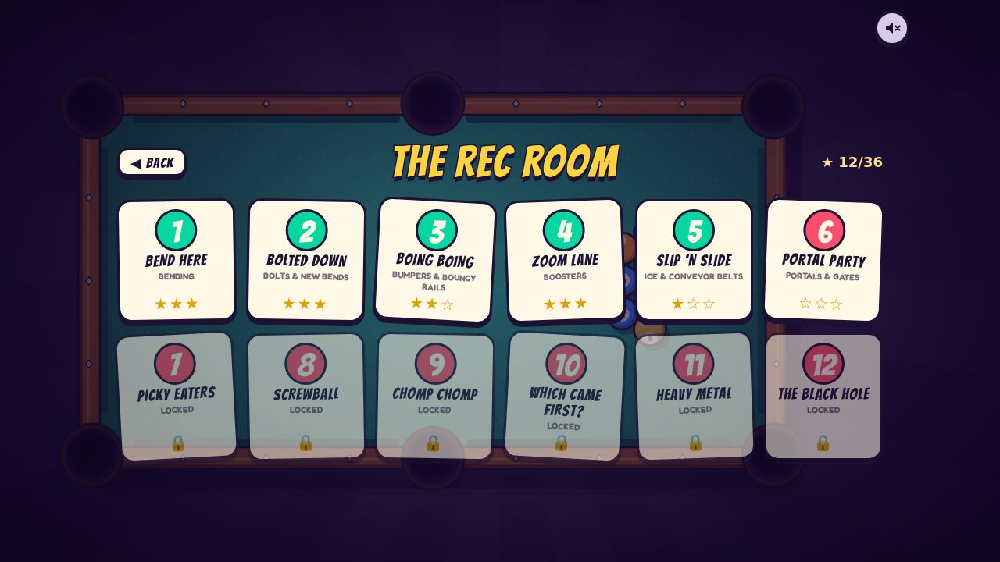
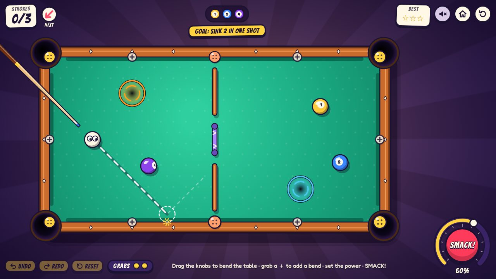
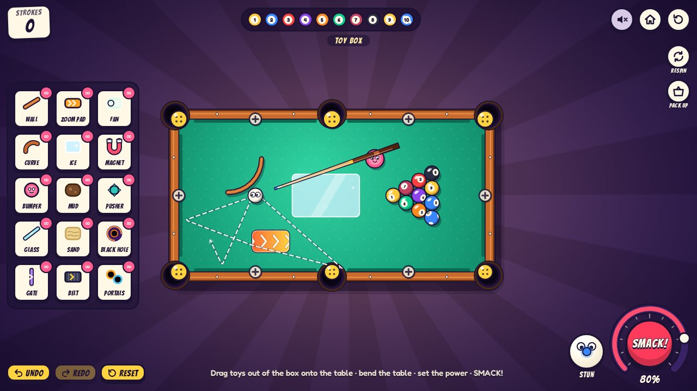
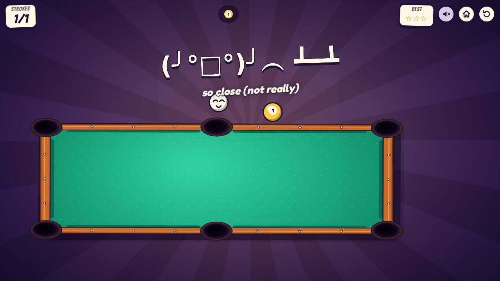
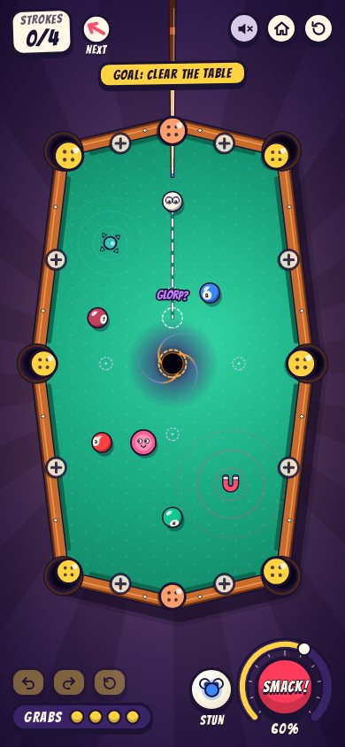

# Bendy Billiards

**Billiards where you can't aim.** Every stroke the cue spins like a roulette wheel and lands
wherever it likes. So you bend the table instead: drag the corners, add new bends, drop in toys,
then pick how hard (and with how much spin) to smack the ball.



## Three ways to play

**Free Play.** Clear all ten balls in as few strokes as you can (par is 20). Every game deals a
remixed table: a named shape (the Diamond, the Bowtie, the L...) plus a couple of twists, such as
bolted or picky pockets, bouncy rails, or toys to place. A preview shows where the cue ball and every
ball it hits will go. Style points (combos, banks, trick shots) break ties with your best score.

**Classic: The Rec Room.** Twelve puzzle tables, each built around one or two tricks. Every level
gives you:

- a goal, such as clearing the table, sinking the 5, or parking on the target
- a few grabs (each moves a knob or a toy once, within reach)
- fixed spins, with the next one shown
- a stroke limit

Win for one to three stars. Lose and the table gets flipped.

**Toy Box.** Every toy, no limits. Build ridiculous tables, **REWIND** a shot, **RESPIN** the cue,
**PACK UP** the toys.

| Level select                                                                             | A Classic level (Portal Party)                                                 |
| ---------------------------------------------------------------------------------------- | ------------------------------------------------------------------------------ |
|                                  |  |
| **Toy Box**                                                                              | **Lose a level...**                                                            |
|  |         |

## How to play

1. **Spin.** The cue whirls around the cue ball and lands at a random angle. Tap to skip ahead.
2. **Bend.** Drag the yellow knobs to move corners (the pockets ride along). Grab a **＋** on a
   rail to add a new bend, and double-tap a bend to remove it. Drag toys out of the box onto the
   table. Drag a toy to move it, and turn it with its knob, the mouse wheel, or Q/E. **UNDO**,
   **REDO** and **RESET** cover everything you did this turn.
3. **Smack.** Drag on the power dial: up for more, down for less. Drag slowly for fine steps; it
   clicks at every 5%. Drag on the little cue ball for English: low to screw back, high to follow
   through, sideways to swerve. Both controls move by how far you drag, never jumping to your
   finger. Then tap **SMACK**.

A scratch (the cue ball going in) costs a stroke, and the pocket spits the cue ball back out
somewhere safe. In Free Play the pockets also get hungry: every shot that pots nothing makes them
bigger, until you feed them.

### Toys and table tricks

| Kind    | What there is                                                                                                                                                                     |
| ------- | --------------------------------------------------------------------------------------------------------------------------------------------------------------------------------- |
| Toys    | walls, curved rails, bumpers, glass panes, one-way gates, speed pads, ice, mud, sand, conveyor belts, pushers, magnets, black holes, portals                                      |
| Pockets | bolted (can't be dragged), corked (shut for a few strokes), picky (warm pockets only eat odd balls, cool ones even), chompers (open and shut on a beat), gentle (only slow balls) |
| Rails   | steel (no new bends), trampoline (extra bouncy), dead (soaks up the speed)                                                                                                        |
| Balls   | bowling ball (heavy), egg (cracks, then breaks), bomb (goes off on its third hard knock), chicken (runs from the cue ball), ghost (only the cue ball can touch it), golden        |

### Replays and sharing

After any shot, **REPLAY** plays it again exactly as it happened. **SHARE** makes a link to that
shot. Whoever opens it watches the very same shot, then can **PLAY THIS TABLE** in the Toy Box.
Links only work from a hosted copy of the game, such as GitHub Pages.



### Controls

| Input                            | Action                                      |
| -------------------------------- | ------------------------------------------- |
| Drag a knob / ＋                 | Bend the table                              |
| Double-tap a bend                | Remove it                                   |
| Drag a toy; its knob, wheel, Q/E | Move it; turn it                            |
| Drag on the power dial, ↑/↓      | Set the power                               |
| Drag on the little cue ball      | English (double-tap to centre it)           |
| SMACK, Space                     | Shoot                                       |
| Tap / Space during the spin      | Skip ahead                                  |
| Z, Y (or Shift+Z), R             | Undo, redo, reset the turn                  |
| Hold F (or HOLD)                 | Fast-forward a shot                         |
| Esc                              | Cancel a windup, stop a replay, close a box |
| M                                | Mute                                        |

Phones get their own layout: the table turns sideways to fill a tall screen, and the controls move
out of its way.

<br clear="right">

## Running it

Needs Node 20.19+ or 22.12+.

```bash
npm install
npm run dev        # http://localhost:5173
npm run build      # typecheck + production build into dist/
npm run preview    # serve dist/
```

URL parameters, handy for sharing or debugging:

| Parameter      | Effect                                     |
| -------------- | ------------------------------------------ |
| `?seed=123`    | Deterministic deals and spins              |
| `?remix=0`     | Free Play on the plain table               |
| `?toys=1`      | Free Play with one of every toy in the box |
| `?level=rr-05` | Straight to a Classic level's intro card   |
| `?dev=1`       | Every Classic level unlocked               |
| `?demo=1`      | Attract mode: the game plays itself        |
| `?mute=1`      | Start muted                                |
| `#s=...`       | A shared shot (made by SHARE)              |

## Tests and tools

```bash
npm test           # unit tests (Vitest)
npm run test:e2e   # browser tests (Playwright)
npm run check      # typecheck + lint + unit tests
npm run solve      # find recorded solutions for Classic levels (LEVEL=rr-07 for one)
npm run balance    # play-testing agents for Free Play balance
```

The unit tests cover physics, toys, pockets, fields and teleports, plus:

- golden hashes that pin the simulation bit for bit
- the preview predicting each shot exactly
- replays and share links
- the match rules
- every Classic level's recorded solution, replayed through the real game

The browser tests drive the game through a small debug surface on `window.__bendy`. It can step
time, force spins, bend, place toys, shoot, replay and share. See `src/debug/api.ts`.

## How it's built

TypeScript and Vite with zero runtime dependencies. Everything is drawn on a 2D canvas, the HUD is
plain DOM, and every sound is synthesized on the fly with Web Audio.

The simulation is deterministic down to the last bit in every browser:

- physics uses only `+ - * /` and `Math.sqrt` (ESLint enforces it)
- shots and drags are quantized
- randomness is stateless and seeded

That is what lets the preview predict a shot exactly, replays and shared links play back the very
same shot, and Classic levels keep recorded solutions that CI replays.

```
src/
  physics/   fixed-step world with adaptive substeps: collisions with balls, rails, walls and
             bumpers; pockets and their traits; fields, portals, felt; English; the turn log
  geom/      polygon maths, the table model, toys compiled into colliders, the guide ray
  game/      the game state machine, bending and toy placement, rulesets, the shot preview, the
             remix, Classic goals, progress and levels (levels/), replays and share links,
             match rules for multiplayer, records and save states
  fx/        jelly rails, particles, word pops, ball faces, and the director that turns game
             events into juice
  render/    camera (fits the screen, turns for portrait phones), table, toys, balls, cue,
             preview, the table flip
  audio/     the synthesizer
  ui/        HUD, menus (home, level select, cards), widgets (power dial, spin, toy box)
tools/       the level solver and the balance agents (run with Vitest, not part of npm test)
docs/        the multiplayer design and these screenshots
```

Physics and game logic never touch the DOM, so they are unit-tested in Node.

**Multiplayer** is designed but not built yet. See [docs/multiplayer.md](docs/multiplayer.md) for
the plan: shared-table and race matches over links or live rooms.

## Deploying to GitHub Pages

`.github/workflows/pages.yml` builds and deploys the game on every push to `master`. Turn it on once,
under **Settings → Pages → Build and deployment → Source: GitHub Actions**. The build uses relative
paths, so it works at `https://<user>.github.io/hello-world/`.

## Credits

Fonts: [Bangers](https://github.com/googlefonts/bangers) and
[Fredoka](https://github.com/hafontia/Fredoka-One), both under the SIL Open Font License 1.1
(see `public/fonts/`).
