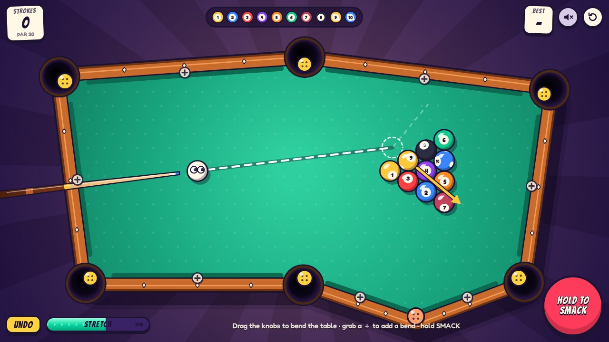
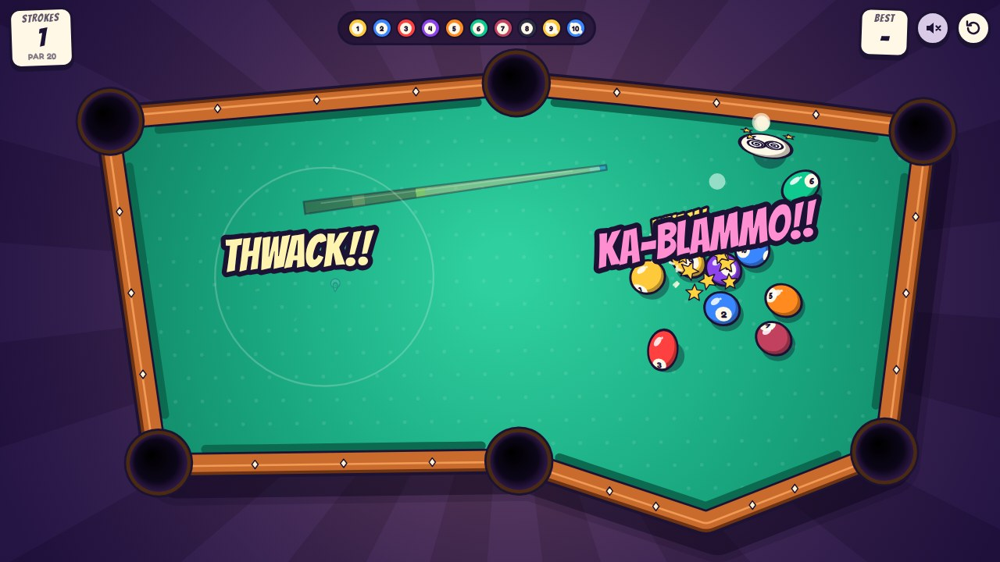
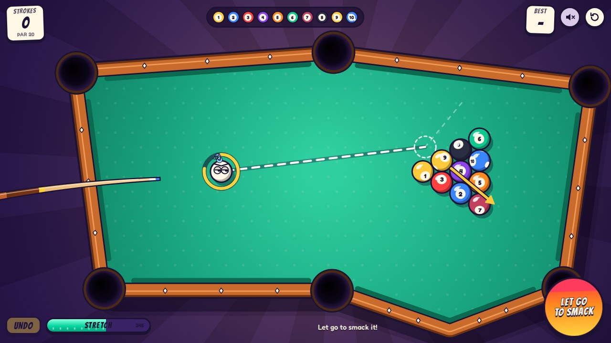

# Bendy Billiards

**Billiards, upside down.** You can't aim. Every turn the cue spins like a roulette wheel and
lands wherever it likes. Your only levers are **bending the table** and **choosing how hard to smack
the ball**. Clear all ten balls in as few strokes as you can.



| The break                                                                     | Charging a shot                                                            |
| ----------------------------------------------------------------------------- | -------------------------------------------------------------------------- |
|  |  |

## How to play

1. **Spin.** The cue whirls around the cue ball and lands at a random angle. Tap to skip ahead.
2. **Bend.** Drag the yellow knobs to move corners (the pockets ride along). Grab a **＋** on a
   rail to add a new bend, and double-tap a bend to remove it. The dashed guide shows where the cue
   ball will go, and an arrow shows where the first ball it hits will go. Bending costs **stretch**:
   the meter refills every turn, and **UNDO** puts the table back the way it was at the start of the turn.
3. **Smack.** Hold **SMACK**, the cue ball, or Space to charge, then let go. A quick tap cancels.

**Scoring.** Every shot is a stroke. A scratch (the cue ball goes in) adds a penalty stroke, and the pocket
spits the cue ball back out somewhere safe. Par is 20. Your best score is saved in the browser.

**House rules.**

- **Hungry pockets.** Every shot that pots nothing makes the pockets bigger and hungrier, up to three
  levels, and they grow teeth. Potting a ball feeds them back to normal.
- **Picky pockets.** Pockets slurp object balls that roll close, but never the cue ball. It has eyes and
  stares back, so it only drops in on a direct hit.
- **Dizzy cue ball.** After the cue ball smacks something, or bounces off three cushions, it gets dizzy
  and skids to a stop.
- **No free lunch.** You can't drag a pocket on top of a ball. Walls can shove balls around, but
  never into a hole.
- **Closed pockets.** Squeeze a corner narrower than a ball and the pocket gets a band-aid.

| Input                              | Action                   |
| ---------------------------------- | ------------------------ |
| Drag a knob / ＋                   | Bend the table           |
| Double-tap a bend                  | Remove it                |
| Hold SMACK, the cue ball, or Space | Charge; release to shoot |
| Tap / Space during the spin        | Skip ahead               |
| Z or Backspace                     | Undo this turn's bending |
| M                                  | Mute                     |

## Running it

Needs Node 20.19+ or 22.12+.

```bash
npm install
npm run dev        # http://localhost:5173
npm run build      # typecheck + production build into dist/
npm run preview    # serve dist/
```

URL parameters, handy for sharing or debugging:

| Parameter   | Effect                                                                 |
| ----------- | ---------------------------------------------------------------------- |
| `?seed=123` | Deterministic rack and spins                                           |
| `?demo=1`   | Attract mode: the game plays itself (without touching your best score) |
| `?mute=1`   | Start muted                                                            |

## Tests

```bash
npm test           # unit tests (Vitest): geometry, physics, reshaping, game flow
npm run test:e2e   # browser tests (Playwright): full turn, real mouse input, demo mode, phone layout
npm run check      # typecheck + lint + unit tests
```

The browser tests drive the game through a small debug surface on `window.__bendy`. It can step time
manually, force the spin angle, drag vertices and shoot. See `src/debug/api.ts`.

## How it's built

TypeScript and Vite with zero runtime dependencies. Everything is drawn on a 2D canvas, the HUD is
plain DOM, and every sound is synthesized on the fly with Web Audio.

```
src/
  physics/world.ts   fixed-step physics: substeps (no tunnelling), ball-ball and ball-rail
                     collisions, pocket suction and capture, settling
  geom/              polygon maths, the table model (rails with pocket mouths, holes pushed
                     outside the corners), the guide ray
  game/              the turn state machine, reshaping (validated sub-steps, ball shoving,
                     stretch budget, undo), the roulette spin, rules, and the demo autopilot
  fx/                jelly springs for the rails, particles, word pops, per-ball squash and
                     rolling decals, and the director that turns game events into juice
  render/            camera (fits the screen and rotates for portrait phones), table, balls, cue
  audio/sfx.ts       the synthesizer: clacks, boings, gulps, burps, a sad trombone, a fanfare
  ui/                HUD, title and score cards, styles, self-hosted fonts
```

Physics and game logic never touch the DOM, so they are unit-tested in Node.

## Deploying to GitHub Pages

`.github/workflows/pages.yml` builds and deploys the game on every push to `master`. Turn it on once,
under **Settings → Pages → Build and deployment → Source: GitHub Actions**. The build uses relative
paths, so it works at `https://<user>.github.io/hello-world/`.

## Credits

Fonts: [Bangers](https://github.com/googlefonts/bangers) and
[Fredoka](https://github.com/hafontia/Fredoka-One), both under the SIL Open Font License 1.1
(see `public/fonts/`).
